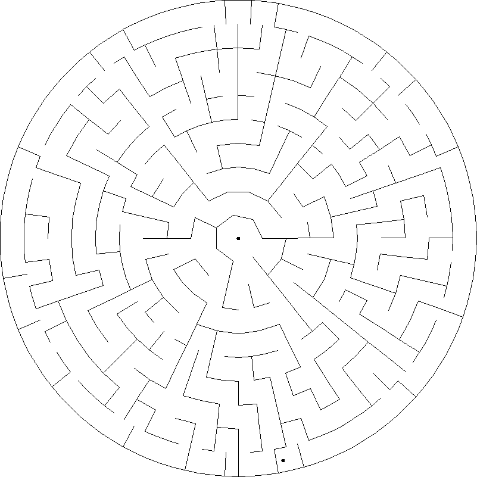
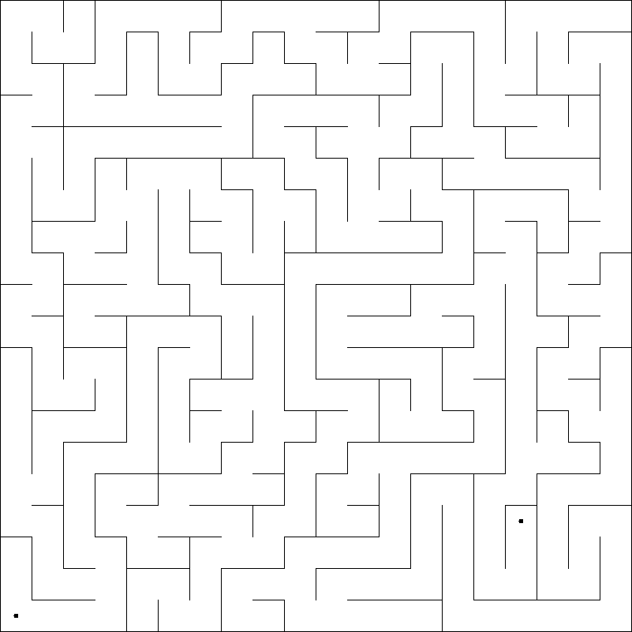
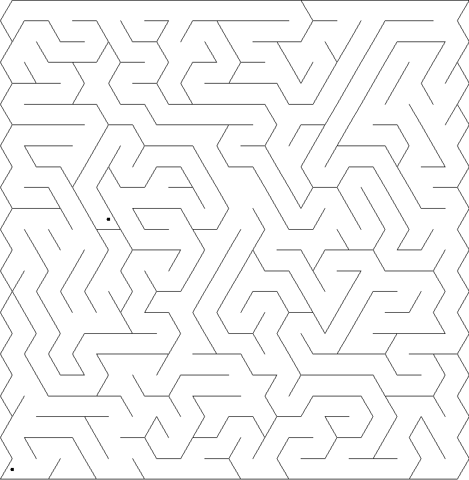
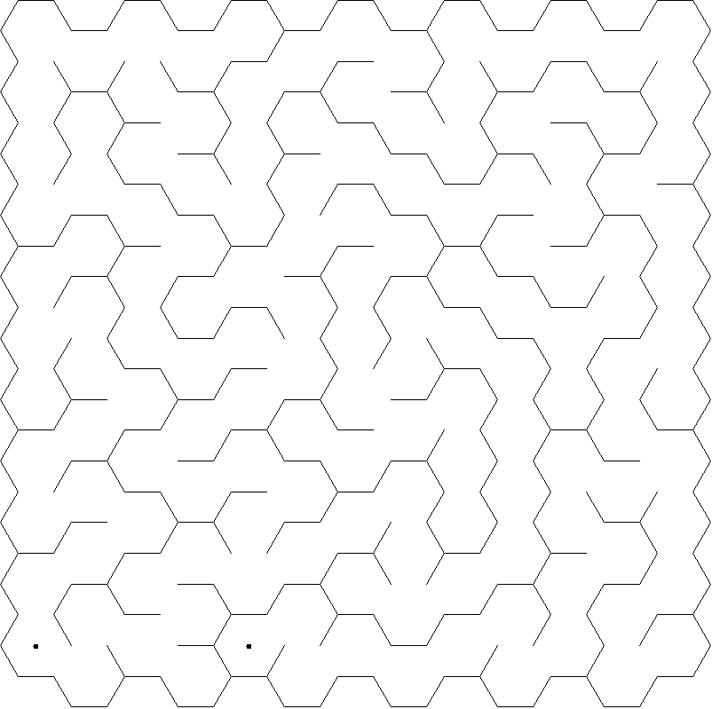

# mazes-scala

A little project I did for fun to play with my daughter while learning Scala, based on the book Mazes for Programmers by Jamis Buck (alumnus of the Ruby on Rails core team).

The code (or, rather, the overall design of the project) is not very functional (just like the book), but it does the job and is straightforward.

Some images:

Related: [rogue-maze](https://github.com/jGonzalezFernandez/rogue-maze)
